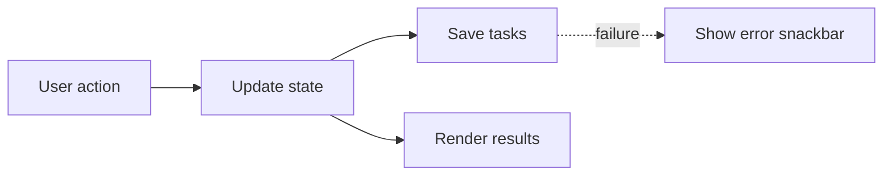

# Phase 1: Browser Basics Task Tracker

**Status:** Complete

**Code:** [apps/phase-1-browser-basics](../../apps/phase-1-browser-basics/)

## Goal

Build a usable local version of the HomeTracker Today workspace with plain HTML, CSS, and JavaScript.

## Learning Focus

- Semantic HTML forms and controls
- DOM events and event delegation
- Application state versus derived UI state
- Rendering data into the DOM
- localStorage persistence
- Browser layout, focus, and accessibility fundamentals

## Scope

- Render tasks in Overdue, Today, Upcoming, and Completed groups
- Add a task with a title, category, and optional due date
- Complete, uncomplete, and delete a task
- Filter by status and category
- Search by task title
- Save tasks to localStorage and restore them after reload
- Support keyboard navigation, visible focus, and correctly labelled controls
- Implement responsive desktop and mobile layouts based on the Today mockup

## Out Of Scope

- React, TypeScript, Next.js, Tailwind, Storybook, and CVA
- API, database, accounts, or syncing
- Shopping lists, projects, and home documentation
- Recurrence calculation, reminders, and notifications
- Drag and drop, sorting controls, and task editing

## Data And State

```js
const task = {
  id: "task_001",
  title: "Replace kitchen smoke alarm battery",
  category: "maintenance",
  dueDate: "2026-07-07",
  isCompleted: false,
  createdAt: "2026-07-09T10:00:00.000Z"
};
```

The application state is the task collection plus the current search and filter values. Task groups are derived during rendering from those values and the current date.

## Acceptance Criteria

- A user can add, complete, uncomplete, delete, search, and filter tasks.
- Reloading the page preserves the task collection.
- The task list updates immediately after every action.
- The app is usable with only a keyboard.
- Inputs have labels and validation messages are understandable.
- The layout remains readable on narrow screens.
- The browser console has no errors.

## Learning Notes

### State And Rendering

My main takeaway is that state is the source of truth. The DOM shows the current
state, and `localStorage` keeps the tasks across reloads.



Search and filters are temporary UI state. The filtered and grouped task lists
are derived from the original tasks rather than stored as extra copies.

### IDs And Array Methods

Task IDs let me target the correct task even when the list has been filtered or
reordered. Array positions are not reliable identities.

- `findIndex()` finds a task's position and returns `-1` when it cannot.
- `splice()` removes an item at a position.
- `some()` is JavaScript's equivalent of `any()` in other languages.
- `filter()` creates a new array of matching items.

UUID collisions are very unlikely, but I still enforce unique IDs when adding
and loading tasks.

### Rendering Boundaries

Rerendering the whole app after every search keystroke destroyed the search
input, which meant manually restoring its value, focus, and cursor.

Splitting out `renderTaskResults()` means only the results change. The browser
keeps the search input alive, so typing feels smoother and native input state is
preserved. If I have to keep repairing focus after a render, the render boundary
is probably too broad.

### Browser And Accessibility Basics

Native controls already provide useful keyboard behavior: Space toggles
checkboxes, arrow keys navigate selects, and Tab moves between controls. Native
date inputs also have browser-specific segmented editing, which explains why a
year may need to be re-entered in full.

I still need to provide clear labels, visible focus styles, contextual accessible
names, validation messages, and error feedback. The layout also needs checking
with long content, narrow screens, keyboard navigation, and zoom rather than
only at the default desktop size.

### Storage Is An Untrusted Boundary

Valid JSON is not necessarily valid task data. I validate field types,
categories, date format, and unique IDs before loaded data reaches state.

Load failures fall back to seed tasks. Save failures show a dismissible snackbar
because the in-memory UI may no longer match what will return after a reload.
