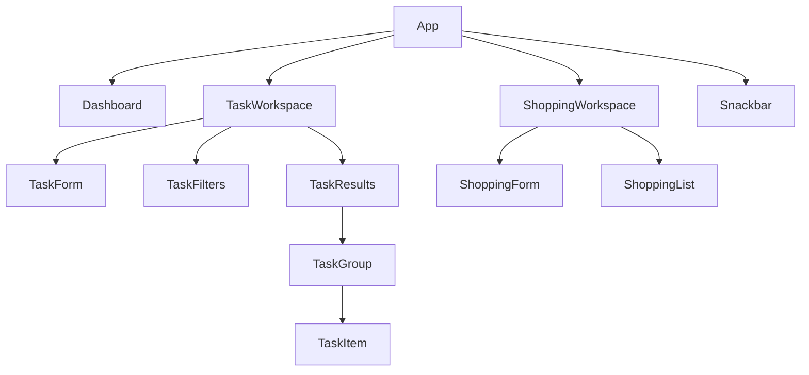

# Phase 2: React And Vite Prototype

**Status:** Scaffolded

**Code:** [apps/phase-2-react-vite](../../apps/phase-2-react-vite/)

## Goal

Rebuild the completed task tracker with React, then extend it with a shopping
list and a small dashboard. The product behavior should stay familiar so the
focus remains on React's rendering and state model.

## Starting Point

Phase 2 starts fresh rather than copying the Phase 1 implementation.

Carry forward:

- Task data shape and seed data
- Product behavior and accessibility requirements
- Search, filtering, grouping, validation, and storage rules
- Design tokens and visual direction

Rebuild with React:

- Components and JSX
- Event handlers
- State ownership and updates
- Controlled forms
- Derived views
- Persistence hooks
- Error feedback

Phase 1 remains available as a working behavioral reference.

## Learning Focus

- JSX and component composition
- Props, state, and state ownership
- Controlled forms
- Immutable state updates
- Derived state
- Component identity and list keys
- Effects for synchronizing with browser APIs
- Custom hooks
- React rendering behavior and boundaries

This phase uses JavaScript. TypeScript is deliberately deferred to Phase 3 so
the learning goals remain separate.

## Scope

### Task Workspace

- Reproduce Phase 1 task behavior in React
- Add, complete, uncomplete, and delete tasks
- Search by title and filter by category and status
- Group tasks into Overdue, Today, Upcoming, and Completed
- Persist and validate tasks through a reusable localStorage hook
- Show accessible validation and storage errors

### Shopping Workspace

- Add, check, and remove shopping items
- Support quick entry and optional categories
- Keep checked items until manually cleared
- Persist shopping items locally

### Dashboard

- Show counts for overdue and due-today tasks
- Show remaining shopping items
- Link summaries to their workspaces

## Out Of Scope

- TypeScript
- Next.js, routing, SSR, or server components
- Tailwind, Storybook, CVA, or a component library
- API, database, accounts, or syncing
- Recurrence calculations and notifications
- Projects and home documentation

## Initial Component Direction

This is a starting vocabulary, not a requirement to create every component
immediately. Components should be introduced when they own a meaningful
responsibility or make their parent easier to understand.

## Delivery Slices

1. Scaffold the React and Vite app with a clean HomeTracker baseline.
2. Build the static task component tree.
3. Render seed tasks through props and stable keys.
4. Add task state, completion, creation, and deletion.
5. Add derived search, filtering, and grouping.
6. Add localStorage synchronization and validation through a custom hook.
7. Build the shopping workspace.
8. Build dashboard summaries from task and shopping state.
9. Complete responsive, keyboard, accessibility, and error-state checks.
10. Record learning notes and close the phase.

## Acceptance Criteria

- Phase 1 task behavior works in React without imperative DOM rendering.
- Task and shopping data survive reloads.
- Dashboard values are derived from the current task and shopping state.
- Forms are controlled and show understandable validation.
- Lists use stable domain IDs as React keys.
- Browser storage synchronization is isolated behind a custom hook.
- The app remains usable by keyboard and on narrow screens.
- The browser console, linter, and production build report no errors.

## Learning Notes

Record short answers as the phase progresses:

- What causes a React component to render?
- Which state belongs in `App` and which belongs closer to a feature?
- When should a value be derived instead of stored?
- Why does React need stable keys?
- Which browser synchronization belongs in an effect?
- What did React simplify compared with the Phase 1 DOM implementation?
