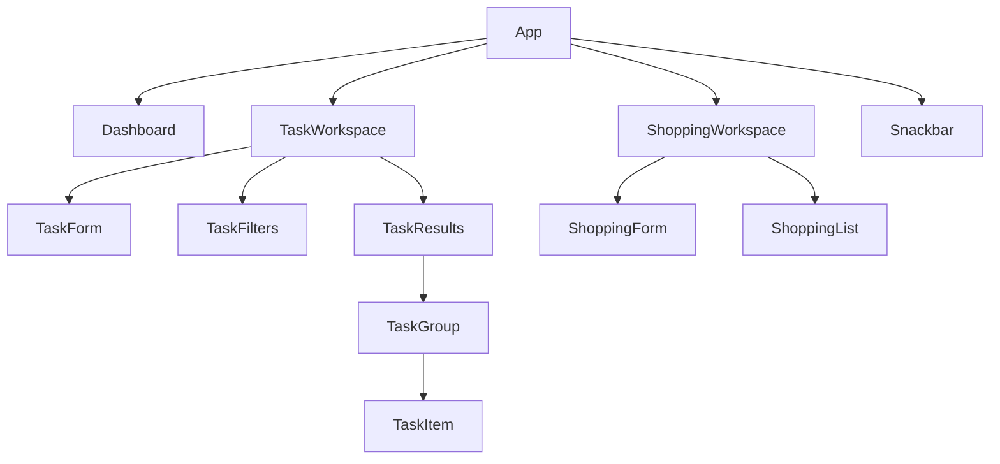

# Phase 2: React And Vite Prototype

**Status:** Complete

**Code:** [apps/phase-2-react-vite](../../apps/phase-2-react-vite/)

## Goal

Rebuild the completed task tracker with React, then extend it with a shopping
list and a small dashboard. The product behavior should stay familiar so the
focus remains on React's rendering and state model.

## Starting Point

Phase 2 starts fresh rather than copying the Phase 1 implementation.

Carry forward:

- Task data shape and seed data
- Product behavior and accessibility requirements
- Search, filtering, grouping, validation, and storage rules
- Design tokens and visual direction

Rebuild with React:

- Components and JSX
- Event handlers
- State ownership and updates
- Controlled forms
- Derived views
- Persistence hooks
- Error feedback

Phase 1 remains available as a working behavioral reference.

## Learning Focus

- JSX and component composition
- Props, state, and state ownership
- Controlled forms
- Immutable state updates
- Derived state
- Component identity and list keys
- Effects for synchronizing with browser APIs
- Custom hooks
- React rendering behavior and boundaries

This phase uses JavaScript. TypeScript is deliberately deferred to Phase 3 so
the learning goals remain separate.

## Scope

### Task Workspace

- Reproduce Phase 1 task behavior in React
- Add, complete, uncomplete, and delete tasks
- Search by title and filter by category and status
- Group tasks into Overdue, Today, Upcoming, and Completed
- Persist and validate tasks through a reusable localStorage hook
- Show accessible validation and storage errors

### Shopping Workspace

- Add, check, and remove shopping items
- Support quick entry and optional categories
- Keep checked items until manually cleared
- Persist shopping items locally

### Dashboard

- Show counts for overdue and due-today tasks
- Show remaining shopping items
- Link summaries to their workspaces

## Out Of Scope

- TypeScript
- Next.js, routing, SSR, or server components
- Tailwind, Storybook, CVA, or a component library
- API, database, accounts, or syncing
- Recurrence calculations and notifications
- Projects and home documentation

## Initial Component Direction



This is a starting vocabulary, not a requirement to create every component
immediately. Components should be introduced when they own a meaningful
responsibility or make their parent easier to understand.

## Delivery Slices

1. Scaffold the React and Vite app with a clean HomeTracker baseline.
2. Build the static task component tree.
3. Render seed tasks through props and stable keys.
4. Add task state, completion, creation, and deletion.
5. Add derived search, filtering, and grouping.
6. Add localStorage synchronization and validation through a custom hook.
7. Build the shopping workspace.
8. Build dashboard summaries from task and shopping state.
9. Complete responsive, keyboard, accessibility, and error-state checks.
10. Record learning notes and close the phase.

## Acceptance Criteria

- Phase 1 task behavior works in React without imperative DOM rendering.
- Task and shopping data survive reloads.
- Dashboard values are derived from the current task and shopping state.
- Forms are controlled and show understandable validation.
- Lists use stable domain IDs as React keys.
- Browser storage synchronization is isolated behind a custom hook.
- The app remains usable by keyboard and on narrow screens.
- The browser console, linter, and production build report no errors.

## Learning Notes

### Props, State, And Callbacks

Props are a component's inputs. They let a parent provide data and behavior
without giving the child ownership of that data. Task and shopping components
receive their current items through props and report user actions through
callback props such as `onTaskDelete` and `onItemBoughtChange`.

State belongs in the closest component that must coordinate every consumer of
it. Tasks and shopping items live in `App` because their workspaces and the
dashboard all need them. Form field values and filters stay inside their
features because no other workspace needs them. This avoids both duplicated
state and an oversized global store.

Callbacks use functional state updates when the next value depends on the
current value:

```js
setTasks((currentTasks) =>
  currentTasks.map((task) =>
    task.id === taskId ? { ...task, isCompleted } : task,
  ),
)
```

The array and changed object are replaced rather than mutated. React can then
observe the new references and render from the new state.

### What Renders, And When Memoization Helps

Calling a state setter schedules a render of the component that owns that
state. React then calls its descendant components again to calculate the next
UI tree. It compares that result with the previous tree and applies only the
required DOM changes; a component render does not mean the whole DOM is
rebuilt.

`memo` can skip a child render when its props are unchanged, but it adds a prop
comparison, makes reference stability more important, and can require
`useCallback` or `useMemo` to be effective. It is an optimization for measured
or clearly expensive work, not a default wrapper for every component. The
lists in this phase are small enough that straightforward rendering is easier
to reason about.

### Stored State Versus Derived Values

Search results, task groups, dashboard counts, preview items, and card tones
are derived during render from task and shopping state. Storing these values
separately would create multiple sources of truth and require synchronization.

The dashboard does not merge task and shopping objects into a new domain
collection. It derives a small presentation model from each collection and
passes only the summary data needed by the dashboard. Task date predicates are
shared with the task results view so `overdue` and `due today` cannot acquire
different meanings in different screens.

### Component Identity And IDs

React keys identify list items across renders. A stable domain ID lets React
keep the correct component identity when items are completed, reordered, or
deleted. Array positions are unsuitable because their meaning changes when the
list changes.

`crypto.randomUUID()` is the browser-standard way to create sufficiently
unique local IDs for this app. `createTask` and `createShoppingItem` are factory
functions: they centralize defaults, normalization, ID creation, and validation
so every new entity starts valid.

### Runtime Validation And TypeScript

`typeof` checks and the validation functions protect the application at
runtime, especially when reading untrusted or stale JSON from local storage.
TypeScript will improve authoring in Phase 3 by detecting incorrect property
names, missing fields, and invalid function arguments before the code runs.
It will not prove that local-storage data is valid because external data does
not become safe merely because the application has a TypeScript type.

Nested objects should be validated recursively at each boundary. First confirm
that each level is a non-null, non-array object, then validate its required
properties and nested values. As models become more complex, a schema library
can remove repetitive checks while still producing runtime evidence.

### Effects And The Local-Storage Hook

An effect synchronizes React with something outside React. This phase uses
effects for browser APIs: saving state to `localStorage` and subscribing to the
browser's `hashchange` event. Values that can be calculated from props or state
do not need an effect.

The navigation effect adds an event listener when the component is connected
to the page and returns a cleanup function that removes the same listener. The
cleanup prevents duplicate subscriptions and stops an old component instance
from reacting after it is removed.

`useLocalStorage` is a custom hook because task and shopping persistence share
one stateful workflow: initialize from storage, parse and validate saved data,
fall back safely, persist later changes, and expose storage errors. The hook
hides browser synchronization while the calling component keeps ownership of
the domain value.

### Controlled Forms

The forms are controlled: React state is the current source of truth for each
input's `value`. Change handlers update that state, and submission reads the
same state. This makes conditional fields, validation messages, resetting, and
submission predictable, at the cost of rendering the form component as input
changes.

### Accessibility Semantics

Native elements remain the first choice: links navigate, buttons perform
actions, headings define structure, labels name inputs, and lists describe
collections. `aria-labelledby` is useful when an element's accessible name
should come from existing visible text; its value is the `id` of the element
that supplies that label. ARIA supplements semantics rather than replacing
them.

Dashboard color is an enhancement rather than the only status signal. The
visible number, heading, item list, and empty-state message communicate the
actual state even if the colors cannot be distinguished. Decorative SVG is
hidden from assistive technology, while meaningful counts remain available.

### Design Tokens And Component Styling

Semantic color tokens such as `--color-success`, `--color-warning`, and
`--color-danger` describe reusable application meanings. Dashboard variables
such as `--dashboard-accent` describe how one component uses those meanings.
The resulting chain is:

```text
count -> semantic tone -> global color token -> component role
```

JavaScript decides whether a count is clear, informational, a warning, or a
danger. CSS decides how each meaning looks. This keeps thresholds out of CSS
and raw color values out of React components.

### What React Simplified

The Phase 1 app manually queried elements, attached handlers, changed DOM
content, and kept rendered HTML synchronized with JavaScript state. In React,
components declare what the UI should look like for the current props and
state. React owns the DOM synchronization, while immutable state updates,
derived values, and component boundaries make the data flow visible in code.

React did not remove the need to understand the browser. Event listeners,
local storage, forms, URLs, focus, semantic HTML, and CSS still behave according
to browser rules; React provides a model for coordinating them.
